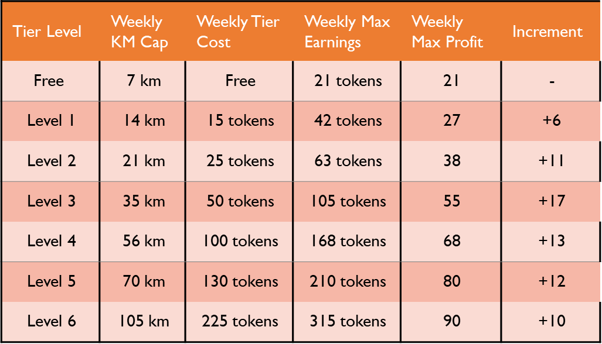

# Implementation

#### WalkIt App

* Every 1km user earns 3 tokens and starts off as Level 1
* Capped at 7km or 21 tokens a week (Level 1)
* Users can upgrade to higher tiers by spending their tokens weekly
* Allows users to earn more tokens weekly
* Anti-Exploitation safety measures
  * Constant monitoring of speed (e.g app stops recording >15km/hr )

#### Token Flow

* WalkIt users can sell tokens for SGD through the liquidity pool
* Tokens can be bought by anyone with SGD through the liquidity pool
* Sustains value of tokens&#x20;

.png>)

#### E-commerce Website

* Sellers and buyers can utilise this platform to sell products
* Currency is only ITT tokens
* Daily tokens raffle rewards&#x20;
  * \+1 entry for every item bought
* The seller has to verify their phone number and email
* The buyer has to confirm past delivery to be eligible for the raffle
  * Allows us to further verify sellers (e.g seller will be rated based on confirmed delivers)

.png>)
